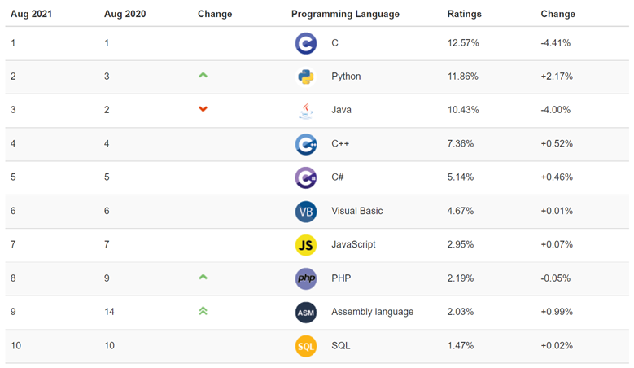

<!-- _class: lead gaia -->

# C++程序设计

电子科技大学

余盛季

---

# 个人简介

**主讲课程**
C++程序设计、形式语言与自动机、程序设计语言与编译

**研究方向**
云计算、大数据、人工智能

---

<!-- _class: lead gaia -->

# 什么是C++

---

<!-- _class: lead -->

**C + 面向对象 + 其它**

---

<!-- _class: lead gaia -->

# 为什么要学习C++

---

<!-- _class: lead -->

https://www.tiobe.com/tiobe-index



---

<!-- _class: lead gaia -->

# 如何学习C++

---

<!-- _class: lead -->

**读代码 + 写代码 + 调代码**

---

<!-- _class: lead gaia -->

# 课程安排

---

**学时分配**
总学时（32）：课堂讲授（16）+ 上机实验（16）

**成绩构成**
课后作业（码图作业，30%）
实验报告（精灵游戏，20%）
期末考试（码图考试，50%）

---

**教材**
C与C++程序设计（戴波）

**参考书**
The C++ Programming Language（Bjarne Stroustrup）
C++ Primer（Stanley B. Lippman）

**课程MOOC**
https://www.icourse163.org/course/UESTC-1001774006?tid=1465243448

---

<!-- _class: lead gaia -->

# 实验环境

编辑器 + 编译器 + 调试器

---

## 编辑器

**Visual Studio Code**

下载：https://code.visualstudio.com/

`Download > Windows > User Installer > 64bit`

文件：VSCodeUserSetup-x64-1.58.2.exe

插件：C/C++、Marp for VS Code

---

## 编译器

**GCC (GNU Compiler Collection)**

下载：https://sourceforge.net/projects/mingw-w64/files/

`MinGW-W64 GCC-8.1.0 > x86_64-win32-seh`

文件：x86_64-8.1.0-release-win32-seh-rt_v6-rev0.7z

解压到任意文件夹，例如 C:\tools\mingw64。

---

将mingw64中的bin目录添加到环境变量Path中：
桌面 > 右击“此电脑” > 属性 > 高级系统设置 > 环境变量 > 用户变量 > Path > 编辑 > 新建 > ...\\...\mingw64\bin

打开命令提示符，执行命令 `g++ --version`，出现版本信息，表示编译器安装成功。

```
C:\>g++ --version
g++ (x86_64-win32-seh-rev0, Built by MinGW-W64 project) 8.1.0
Copyright (C) 2018 Free Software Foundation, Inc.
This is free software; see the source for copying conditions.  There is NO
warranty; not even for MERCHANTABILITY or FITNESS FOR A PARTICULAR PURPOSE.

C:\>
```

---

## 调试器

**GDB (The GNU Project Debugger)**

打开命令提示符，执行命令`gdb --version`，出现版本信息，表示调试器安装成功。

```
C:\>gdb --version
GNU gdb (GDB) 8.1
Copyright (C) 2018 Free Software Foundation, Inc.
License GPLv3+: GNU GPL version 3 or later <http://gnu.org/licenses/gpl.html>
This is free software: you are free to change and redistribute it.

C:\>
```

---

**参考资料**
[GCC](https://gcc.gnu.org/onlinedocs/)
[GCC参数详解](https://www.runoob.com/w3cnote/gcc-parameter-detail.html)
[GDB](http://www.gnu.org/software/gdb/documentation/)
[C++ GDB调试大全](https://blog.csdn.net/bigheadyushan/article/details/77828949)
[C/C++ for Visual Studio Code](https://code.visualstudio.com/docs/languages/cpp)
[Using GCC with MinGW](https://code.visualstudio.com/docs/cpp/config-mingw)

---

<!-- _class: lead gaia -->

# C++程序实例

---

# 第一个C++程序

```c++
int main()
{
    return 0; /* 1、2、3…… */
}
```

编译：g++ test.cpp -o test.exe
执行：test.exe
查看结果（返回值）：

```
echo %errorlevel%
```

---

# 第二个C++程序

```c++
#include <stdio.h>
int main()
{
    printf("Hello, I'm a C++ program.\n");
    return 0;
}
```

库函数：printf
头文件：stdio.h
文件路径：C:\tools\mingw64\x86_64-w64-mingw32\include\stdio.h

---

# 第三个C++程序

```c++
#include <iostream>
using namespace std;
int main()
{
    cout << "Hello, I'm really a C++ program." << endl;
    return 0;
}
```

输出流对象：cout
头文件：iostream
文件路径：C:\tools\mingw64\lib\gcc\x86_64-w64-mingw32\8.1.0\include\c++\iostream

---

# 输入与输出

输出流对象：cout
左移运算符：<<

```
int a = 1, b = 2;
printf("a + b = %d \n", a + b);

int c = 3, d = 4;
cout << "c + d = " << c + d << endl; 
```

---

输入流对象：cin
右移运算符：>>

```
int a, b;
scanf("%d %d", &a, &b);
printf("a + b = %d \n", a + b);

int c, d;
cin >> c >> d;
cout << "c + d = " << c + d << endl; 
```

---

**参考资料**
[cout格式化输出](http://c.biancheng.net/view/7578.html)
[cin深入分析](https://blog.csdn.net/dongtingzhizi/article/details/2299358)

---

<!-- _class: lead gaia -->

# 数据类型

---

## 逻辑类型

```
int i,j;
bool a,b;

a = true;
b = false;
cout << "a = " << a << ", " << "b = " << b << endl;

i=a;
j=b;
cout << "i = " << i << ", " << "j = " << j << endl;

a = !i;
b = !j;
cout << "a = " << a << ", " << "b = " << b << endl;
```

---

<!-- _class: lead gaia -->

## 引用类型

---

### 独立引用

引用就是别名。

```
int number = 15;
int & n = number;
n = 18;
cout << number << " " << n << endl;
```

如何验证？

---

**程序调试**

设置编译选项：g++ -g test.cpp -o test.exe

启动调试器：gdb test.exe

执行与退出：run, quit ……

设置断点：break, info, del, enable, disable, watch ……

控制程序执行：next, step, continue, finish, set, call ……

查看程序状态：list, print, display, info, watch, backtrace ……

---

### 初始化

必须在定义的时候初始化，以后不能再引用别的变量。

```
int a=1, b=2;
int &n = a;
n = b;
n = 3;
cout << a << " " << b << " " << endl;
```

---

<!-- _class: lead gaia -->

### 常引用

---

普通引用不能作为常量的别名。

常引用可以作为常量的别名。

```
const int &n = 1;
```

常引用也可以作为变量的别名。

```
int a=1;
const int &n = a;
```

无论怎样，常引用的值都不能修改。

```
n = 3; /* 错误 */
```

---

**常量与宏**

```
#define PI 3.14

int main()
{
    float x, y;
    const float pi=3.14;

    x=PI;
    y=pi;
    cout << x << " " << y << endl;

    return 0;
}

```

---

**常量与指针**

```
#define PI 3.14

int main()
{
    float x, y;
    const float pi=3.14;

    x=PI;
    y=pi;
    cout << x << " " << y << endl;

```
---
```

    float * const p1=&x;
    // p1=&y;
    // *p1=1.11;

    float const * p2=&x;
    // p2=&y;
    // *p2=1.11;

    float const * const p3=&x;
    // p3=&y;
    // *p3=1.11;

    cout << x << " " << y << endl;

    return 0;
}
```

---

**几个容易混淆的概念**

指针常量：指针类型的常量（别乱指）

常量指针：指向常量的指针（别乱动）

指向常量的指针常量（别乱指 + 别乱动）

---

<!-- _class: lead gaia -->

### 函数参数

---

**普通变量作为参数**

```
void swap(int x, int y)
{
    int tmp;
    tmp=x;
    x=y;
    y=tmp;
}
```

---

**指针变量作为参数**

```
void swap(int * x, int * y)
{
    int tmp;
    tmp=*x;
    *x=*y;
    *y=tmp;
}
```

---

**引用作为参数**

```
void swap(int & x, int & y)
{
    int tmp;
    tmp=x;
    x=y;
    y=tmp;
}
```

---

<!-- _class: lead gaia -->

### 函数返回值

---

**返回普通类型（右值）**

```
int x=1;
int f()
{
    x=2;
    return x;
}
int main()
{
    int a=3;
    a = f(); 
    cout << a << endl;
}
```

右值只能放在赋值符号的右边，因为它代表的仅仅是一个“值”。

---

**返回引用（左值）**

```
int x=1;
int & f()
{
    x=2;
    return x;
}
int main()
{
    int a=3;
    f() = a; 
    cout << x << endl;
}
```

左值既可以放在赋值符号的左边，也可以放在赋值符号的右边，因为它代表的是一个“内存单元”。

---

<!-- _class: lead gaia -->

### 内联函数

---

```
inline int add(int value) 
{
    int x;
    x = value + 1;
    x = x + 2;
    x = x + 3;
    return x;
}

int main()
{
    int a,b;
    cin >> a;
    b=add(a);
    cout << b << endl;
    return 0;
}
```

---

**内联与编译优化**

inline仅仅是程序员对编译器提出的一个优化建议，是否采纳，还要看编译器自己。

即使不提这个建议，编译器也可能在适当的时候自动进行内联。

编译优化选项：`-O`

```
g++ -O test.cpp -o test.exe
```

---

<!-- _class: lead gaia -->

### 函数重载

---

```
int GetMax2(int x, int y)
{
    if(x>y)
        return x;
    else
        return y;
}

int GetMax3(int x, int y, int z)
{
    int tmp1,tmp2;
    tmp1=GetMax2(x,y);
    tmp2=GetMax2(tmp1,z);
    return tmp2;
}

int main()
{
    return 0;
}
```

---

在编译的过程中，编译器会把函数名在原先的基础上做一些改变。

C 编译器：

```
gcc test.c -o test.exe
nm test.exe | find "GetMax"
004015c0 T _GetMax2
004015d5 T _GetMax3
```

C++ 编译器：

```
g++ test.cpp -o test.exe
nm test.exe | find "GetMax"
004015c0 T __Z7GetMax2ii
004015d5 T __Z7GetMax3iii
```
---

C++ 编译器的修改方式，使得源代码中即使使用了两个完全相同的函数名，在编译的过程中也不会发生重名冲突，只要满足以下两个条件之一即可：

1. 参数个数不同

2. 参数类型不同

---

参数个数不同：

```
int GetMax(int x, int y)
int GetMax(int x, int y, int z)
```

修改后的函数名：

```
nm test.exe | find "GetMax"
004015c0 T __Z6GetMaxii
004015d5 T __Z6GetMaxiii
```

---

参数类型不同：

```
int GetMax(int x, int y)
int GetMax(float x, float y)
```

修改后的函数名：

```
nm test.exe | find "GetMax"
004015d5 T __Z6GetMaxff
004015c0 T __Z6GetMaxii
```

---

当存在形参个数或类型不同的同名函数，在函数调用时，编译器会根据实参的类型及个数的最佳匹配来选择调用哪一个函数。


通过调试器观察函数何时被调用：

```
(gdb) b *0x004015c0
Breakpoint 3 at 0x4015c0: file test.cpp, line 5.
(gdb) b *0x004015d5
Breakpoint 4 at 0x4015d5: file test.cpp, line 13.
```

---

<!-- _class: lead gaia -->

### 默认形参值

---

可以在定义函数时给出默认的形参值。调用函数时如果给出了实参值，则使用给出的实参值；如果未给出实参值，则使用默认的形参值。

```
int Register(int number, char const * name, int age=18, char const * country="China")
{
    cout << "Number: " << number << endl;
    cout << "Name: " << name << endl;
    cout << "Age: " << age << endl;
    cout << "Country: " << country << endl << endl;
    return 0;
}
int main()
{
    Register(1,"ZhangSan");
    Register(2,"LiSi");
    Register(3,"WangWu", 20);
    Register(4,"Tom", 18, "England");
    return 0;
}
```

---

**形参的顺序**
无默认值的形参在前，有默认值的形参在后。

**注意** 
本身不是函数重载，但可能会和函数重载相互影响。
编译器处理函数调用时，如果不能确定该调用哪个函数，则会出现编译错误；如果能够确定该调用哪个函数，则不会出现编译错误。

---

```
int Register(int number, char const * name, int age=18, char const * country="China")
{
    cout << "Number: " << number << endl;
    cout << "Name: " << name << endl;
    cout << "Age: " << age << endl;
    cout << "Country: " << country << endl << endl;
    return 0;
}

int Register(int number, char const * name)
{
    cout << "Number: " << number << endl;
    cout << "Name: " << name << endl;
    cout << "Age: " << 18 << endl;
    cout << "Country: " << "China" << endl << endl;
    return 0;
}

```
---
```

int main()
{
    Register(1,"ZhangSan"); /* error */
    Register(2,"LiSi"); /* error */
    Register(3,"WangWu", 20); 
    Register(4,"Tom", 18, "England"); 
    return 0;
}
```

---

<!-- _class: lead gaia -->

### 动态内存分配和释放

---

C语言的动态内存分配和释放使用***函数***：malloc()、free()等。

它们来自标准函数库。

```
#include <stdlib.h>

int main()
{
    int * a;
    a = malloc(sizeof(int));
    free(a);
    return 0;
}
```

---

C++语言的动态内存分配和释放使用***运算符***：new、delete。

它们是语言的组成部分。

```
int main()
{
    int * a;
    a = new int;
    delete a;
    return 0;
}
```

---

**使用方法**

分配和释放一个变量的空间：
type *p; p=new type; delete p;

```
int main()
{
    int * a;
    a = new int;
    *a = 123;
    cout << *a;
    delete a;
    return 0;
}
```

---

分配和释放一个变量的空间，并赋予初值：
type *p; p=new type(x); delete p;


```
int main()
{
    int * a;
    a = new int(456);
    cout << *a;
    delete a;
    return 0;
}
```

---

分配和释放多个变量（一个数组）的空间：
type *p; p=new type[x]; delete []p;

```
#include <iostream>
#include <cstring>
using namespace std;

int main()
{
    char * a;
    a = new char[10];
    strcpy(a,"hello");
    cout << a;
    delete []a;
    return 0;
}
```

---

未delete或重复delete，都可能导致程序崩溃，这与操作系统的内存管理方法相关。

```
#include <iostream>
using namespace std;

void func(int i)
{
    char *p;
    p=new char[1000000];
    cout  << i << endl;
    delete []p;
}

```
---
```

int main()
{
    for(int i=1; i<=4000; i++){
        func(i);
    }

    cout << "OK" << endl;
    return 0;
}
```

